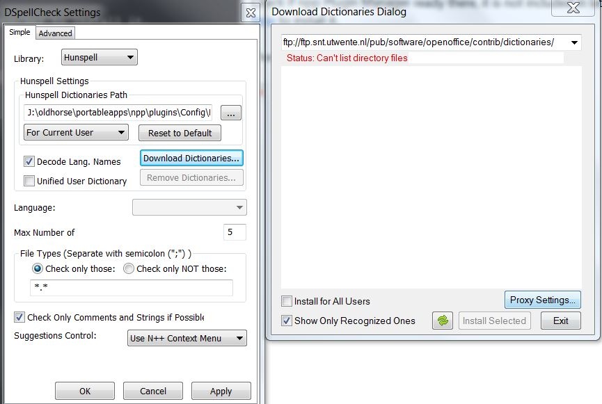

## Install npp spell checker

Check if npp Plugin Manager ready there, it is not included in latest npp x64, you can follow up [here](https://github.com/robertluwang/npp-setting/blob/master/npp-plugin-manager.md) to install it.

Then launch Plugin Manager, find DSpellCheck to install it.


## Install Hunspell dictionary
Check Spell Checker it seems not working, from plugin setting, it stuck at ftp download:
```
ftp://ftp.snt.utwente.nl/pub/software/openoffice/contrib/dictionaries/
Status:Cannot list directory files
```



At first I thought hunspell.dll missing since there is not npp\plugins\Config\Hunspell, I created [issue](https://github.com/Predelnik/DSpellCheck/issues/111), Sergey confirmed hunspell.dll is linked into plugin statically, so issue is on dictionary installation.

As soon as I manually downloaded dictionary en_US.zip from ftp server:
```
ftp://ftp.snt.utwente.nl/pub/software/openoffice/contrib/dictionaries
```
and placed en_US.* to npp\plugins\Config\Hunspell, restart npp then spell checker is working now.

Note: Nov 24, 2017 dictionary ftp issue fixed by owner of SDpellCheck [Sergey Semushin](https://github.com/predelnik), he sent me the [issue](https://github.com/Predelnik/DSpellCheck/issues/111) [fix](https://drive.google.com/uc?export=download&id=1jpQwMxPDOUryoEpjV2brfv2JALDmdYux) and verified it is working well.

## Suggestion Control
There are two options:
- Special Suggestion Button
- Use N++ Context Menu

I prefer Special Suggestion Button, even you can change button size and opacity in advanced tab.

Enjoy the elegant spell checker in npp.


