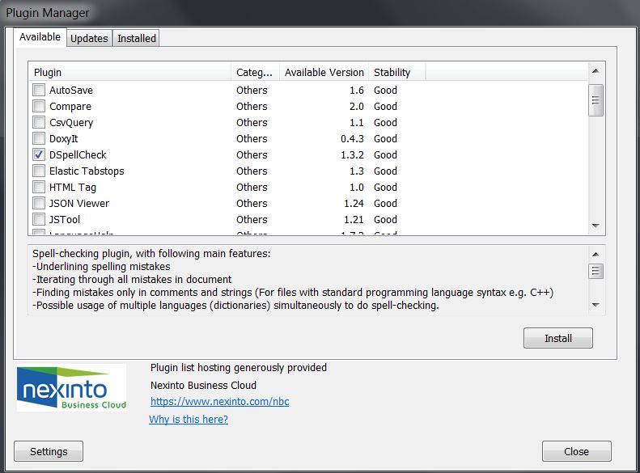

## Install npp spell checker

Check if npp Plugin Manager ready there, it is not included in latest npp x64, you can follow up [here](https://github.com/robertluwang/npp/blob/master/npp-plugin-manager.md) to install it.

Then launch Plugin Manager, find DCheckSpecker to install it.



## Install Hunspell dictionary
Check DSpellChecker setting, Hunspell library seems not existing at this location:
```
npp\plugins\Config\Hunspell
```

also download dictionaries not working:
```
ftp://ftp.snt.utwente.nl/pub/software/openoffice/contrib/dictionaries/
Status:Cannot list directory files
```


After some research, what we miss is dll and dictionary, I made [this zip](https://github.com/robertluwang/npp/blob/master/Hunspell.zip) for default US English.
```
hunspell.dll
en_US.aff
en_US.dic
```

You can download and extract folder hunspell\ to npp\plugins\Config\, restart npp you will spell checker is working now.

You can manually download more dictionaries from this [ftp server](
ftp://ftp.snt.utwente.nl/pub/software/openoffice/contrib/dictionaries/), then places to npp\plugins\Config\Hunspell\.

## Suggestion Control
There are two options:
- Special Suggestion Button
- Use N++ Context Menu

I prefer Special Suggestion Button, even you can change button size and opacity in advanced tab.


